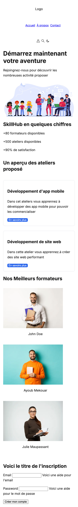
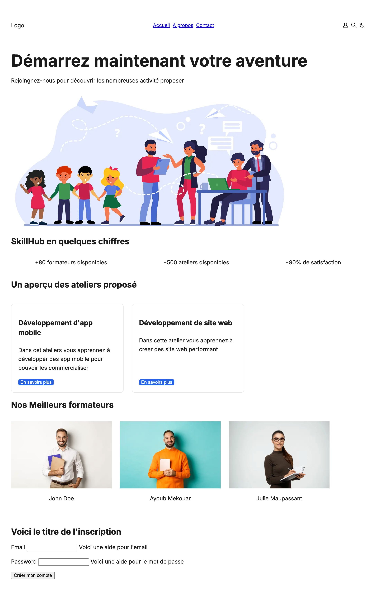

# Rapport d'intégration Responsive - TP3

## 1. Tableau des points de rupture + justification + solutions

| Palier | Point de rupture | Justification | Solution |
| :--- | :--- | :--- | :--- |
| **Mobile** | 320px (<45em) | Hero section trop large à cause de l'image. Elle créé un écart avec les autres sections qui dû à ça ont un grand espace blanc à droite| Réduire la largeur de l'image |
| **Tablette** | 720px (45em) | Les valeurs on un grand espace vide à droite | mettre l'élément en `flex-direction: row` pour l'afficher horizontalement |
| **Ordinateur** | 960px (60em) | Aucun point de rupture | Pas de modification faite|

## 2. Scroll horizontal
Pour éviter le scroll horizontal j'ai ajouter la propriété `overflow-x: hidden;` 

## 2. Captures de l'interface sur les trois versions : mobile - tablette - ordinateur
### Mobile 

### Tablette

### Ordinateur
